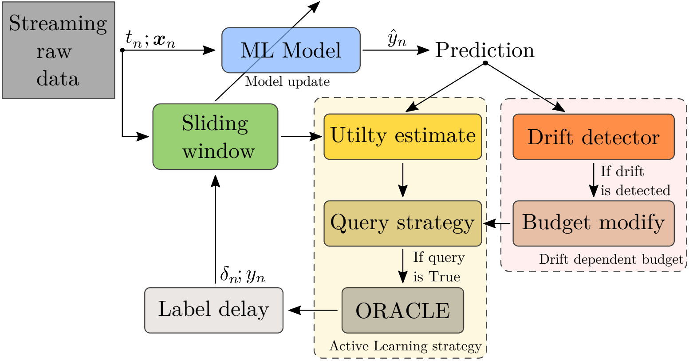

## Stream-based Active Learning with Verification Latency in Non-stationary Environments

This repository contains the implementation of the methods proposed in the paper [Stream-based Active Learning with Verification Latency in Non-stationary Environments](https://arxiv.org/abs/2204.06822) by Andrea Castellani, Sebastian Schmitt and Barbara Hammer (submitted to ICANN 2022).

      
Figure 1: Stream-based Active Learning framework.

[arXiv:2204.06822](https://arxiv.org/abs/2204.06822) Abstract:

> 
Data stream classification is an important problem in the field of machine learning. Due to the non-stationary nature of the data where the underlying distribution changes over time (concept drift), the model needs to continuously adapt to new data statistics. Stream-based Active Learning (AL) approaches address this problem by interactively querying a human expert to provide new data labels for the most recent samples, within a limited budget. Existing AL strategies assume that labels are immediately available, while in a real-world scenario the expert requires time to provide a queried label (verification latency), and by the time the requested labels arrive they may not be relevant anymore. In this article, we investigate the influence of finite, time-variable, and unknown verification delay, in the presence of concept drift on AL approaches. We propose PRopagate (PR), a latency independent utility estimator which also predicts the requested, but not yet known, labels. Furthermore, we propose a drift-dependent dynamic budget strategy, which uses a variable distribution of the labelling budget over time, after a detected drift. Thorough experimental evaluation, with both synthetic and real-world non-stationary datasets, and different settings of verification latency and budget are conducted and analyzed. We empirically show that the proposed method consistently outperforms the state-of-the-art. Additionally, we demonstrate that with variable budget allocation in time, it is possible to boost the performance of AL strategies, without increasing the overall labeling budget.

### TODO: add polished code
